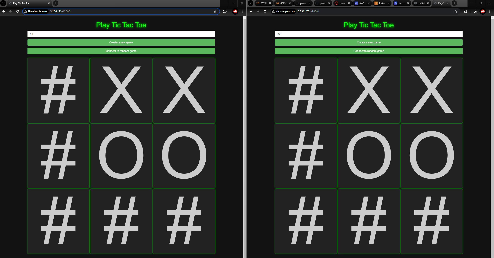
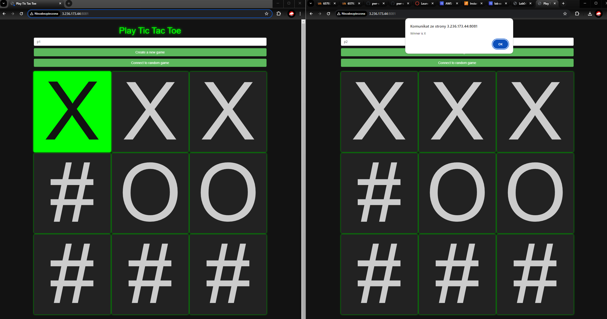

# Konrad Rudnicki - Terraform, EC2, TicTacToe report

- Course: *Cloud programming*
- Group: Group 4
- Date: 22.04.2024

## Environment architecture

- Backend: Java with Spring Booot
- Frontend: Html/Css/Js

## Preview

Screenshots of configured AWS services. Screenshots of your application running.

## Reflections

- What did you learn?
  I learned hot to deplyos application on AWS with terraform.

- What obstacles did you overcome?
  I had issue with downloading the repository.

- What did you help most in overcoming obstacles?
  Googling the answer.

- Was that something that surprised you?
  How easy it is to deploy apps on AWS while you have the configuration for it.
